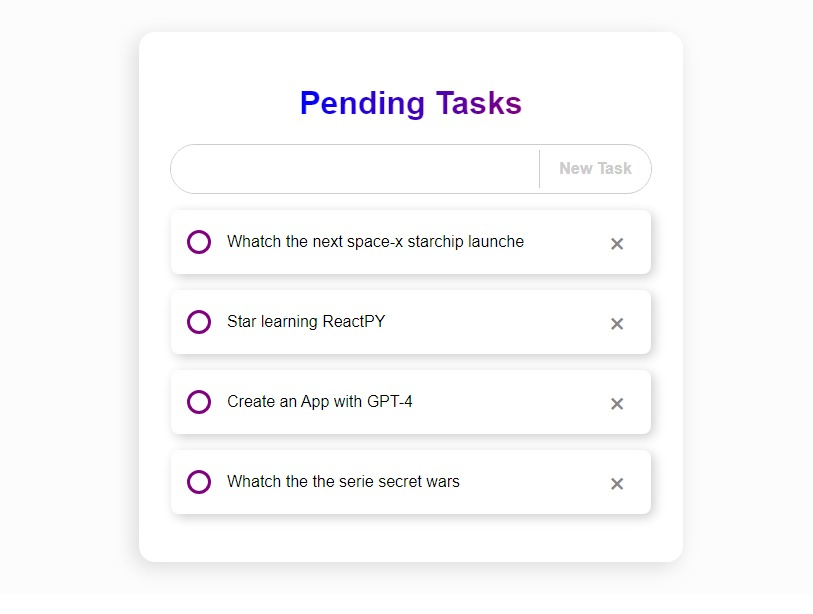

# First-ReactPY-Project

A simple ToDo application, to create my first project in ReactPY and try some of its features.



Initialized the project with the command:

```bash
uvicorn main:app --relaod
```
